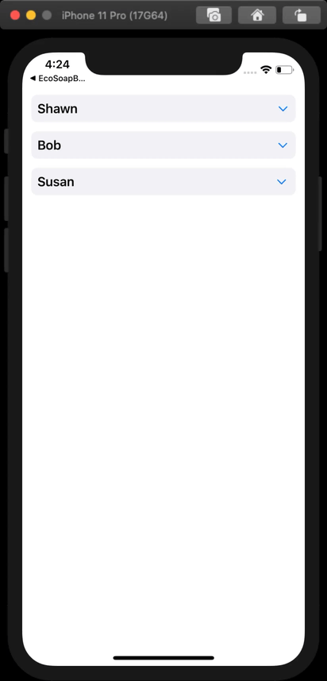

# Expanding Collection View Cell

This is a sample project demonstrating how to set up a collection view cell and collection view controller to allow the cells to animate open and closed. The technique used here could also be used to do any number of other animations in the cell upon selection. The process is quite simple once you know how to do it, but can be a bit tricky trying to figure it out the first time around.

This project is set up using a diffable data source and compositional layout for the collection view. However, I will add a branch shortly that will show how to get the same result using a traditional data source and flow layout. 

------

# Demo



------

# Key Points

## Cell

When setting up your constraints, create properties for any constraints that need to be modified or activated/deactivated in order to open or close the cell:

``` swift
private var closedConstraint: NSLayoutConstraint?
private var openConstraint: NSLayoutConstraint?
```

Then take care to set up your constraints so that they properly define the height of your cell, and use priority to make sure your content stays where you want it when the cell expands and contracts:

``` swift
NSLayoutConstraint.activate([
    rootStack.topAnchor.constraint(equalTo: topAnchor, constant: padding),
    rootStack.leadingAnchor.constraint(equalTo: leadingAnchor, constant: padding),
    rootStack.trailingAnchor.constraint(equalTo: trailingAnchor, constant: -padding),
])

// We need constraints that define the height of the cell when closed and when open
// to allow for animating between the two states.
closedConstraint =
    nameLabel.bottomAnchor.constraint(equalTo: bottomAnchor, constant: -padding)
closedConstraint?.priority = .defaultLow // use low priority so stack stays pinned to top of cell

openConstraint =
    favoriteMovieLabel.bottomAnchor.constraint(equalTo: bottomAnchor, constant: -padding)
openConstraint?.priority = .defaultLow
```


In order to modify the cell's appearance when it is selected or deselected, use a `didSet` on the `isSelected` property of the cell to call an update method:

``` swift
override var isSelected: Bool { didSet { updateAppearance() } }
```

In the update method, modify the properties you would like to change. I found that constraints are properly animated in combination with the technique I used in the collection view delegate. However, other things such as transform must be explicitly animated in order to properly animate in all circumstances:

``` swift
/// Updates the views to reflect changes in selection
private func updateAppearance() {
    closedConstraint?.isActive = !isSelected
    openConstraint?.isActive = isSelected
    
    UIView.animate(withDuration: 0.3) { // 0.3 seconds matches collection view animation
        // Set the rotation just under 180º so that it rotates back the same way
        let upsideDown = CGAffineTransform(rotationAngle: .pi * 0.999 )
        self.disclosureIndicator.transform = self.isSelected ? upsideDown :.identity
    }
}
```

## Collection View Layout

When creating a `UICollectionViewCompositionalLayout`, use an estimated dimension for any dimensions that you want to be defined by the cell. Do so in both the item and group size. An easy way to do this is to use one size for both of them:

``` swift
// The item and group will share this size to allow for automatic sizing of the cell's height
let itemSize = NSCollectionLayoutSize(widthDimension: .fractionalWidth(1.0),
                                     heightDimension: .estimated(50))

let item = NSCollectionLayoutItem(layoutSize: itemSize)

let group = NSCollectionLayoutGroup.horizontal(layoutSize: itemSize,
                                                 subitems: [item])
```

## Collection View Delegate

In order to support deselecting the currently selected cell, implement `shouldSelectItemAt` instead of `didSelectItemAt`. Then in this method, manually select or deselect the cell. After doing so, refresh the data source by reapplying the current snapshot:

``` swift
extension PeopleViewController: UICollectionViewDelegate {
    func collectionView(_ collectionView: UICollectionView, shouldSelectItemAt indexPath: IndexPath) -> Bool {
        guard let dataSource = dataSource else { return false }

        let cell = collectionView.cellForItem(at: indexPath)

        if cell?.isSelected ?? false { // Allows for closing an already open cell
            collectionView.deselectItem(at: indexPath, animated: true)
        } else {
            collectionView.selectItem(at: indexPath, animated: true, scrollPosition: [])
        }
        
        dataSource.refresh()
        
        return false // The selecting or deselecting is already performed above
    }
}

extension UICollectionViewDiffableDataSource {
    /// Reapplies the current snapshot to the data source, animating the differences.
    /// - Parameters:
    ///   - completion: A closure to be called on completion of reapplying the snapshot.
    func refresh(completion: (() -> Void)? = nil) {
        self.apply(self.snapshot(), animatingDifferences: true, completion: completion)
    }
}
```


